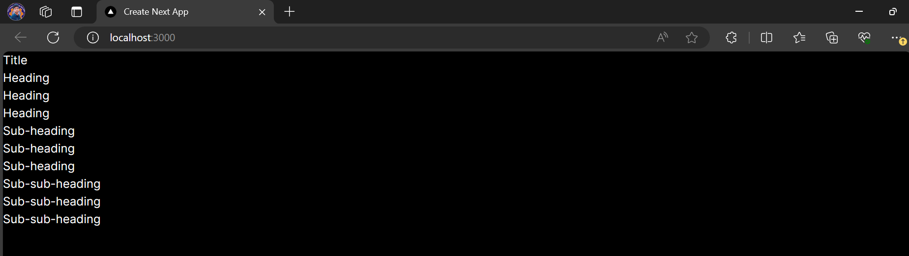

## Laporan Praktikum

|  | Pemrograman Berbasis Framework 2024 |
|--|--|
| NIM |  2141720269|
| Nama |  Muhammad Asad |
| Kelas | TI - 3I |

## Question 1
Explain what you have learned and how does it look now?

I learned about using context to provide data to components in a component tree. Apart from that, I also learned the principles of atomic design which helps in structuring components into smaller and easier to manage parts.